5 pts Your GitHub account showing that is has been forked from the depaulcdm/springpetclinic repository.  
This doesn’t actually need an image – I can see it from your repository.  

5 pts Your GitHub Actions dashboard showing a successful first build.  
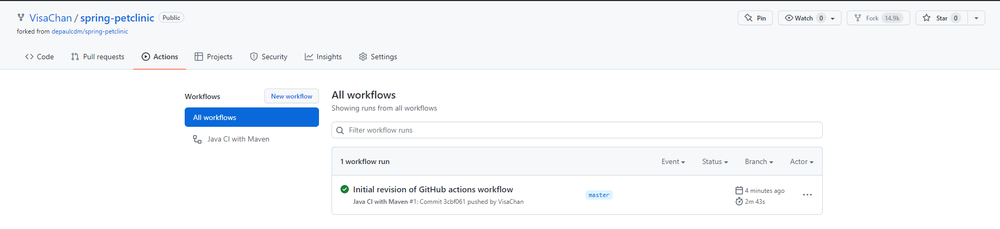  

5 pts Your GitHub repository with the readme.md file selected showing the code that you changed to update the badge.  
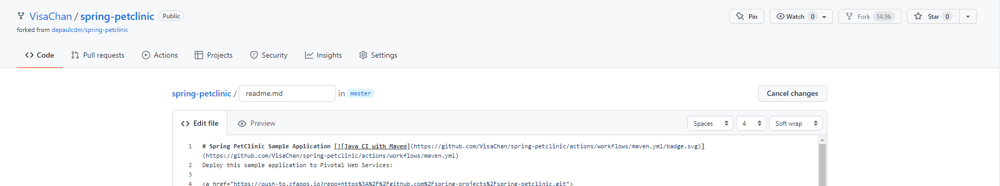  

5 pts Your GitHub repository with the readme.md file selected showing the build success status after you’ve updated the badge markdown.  
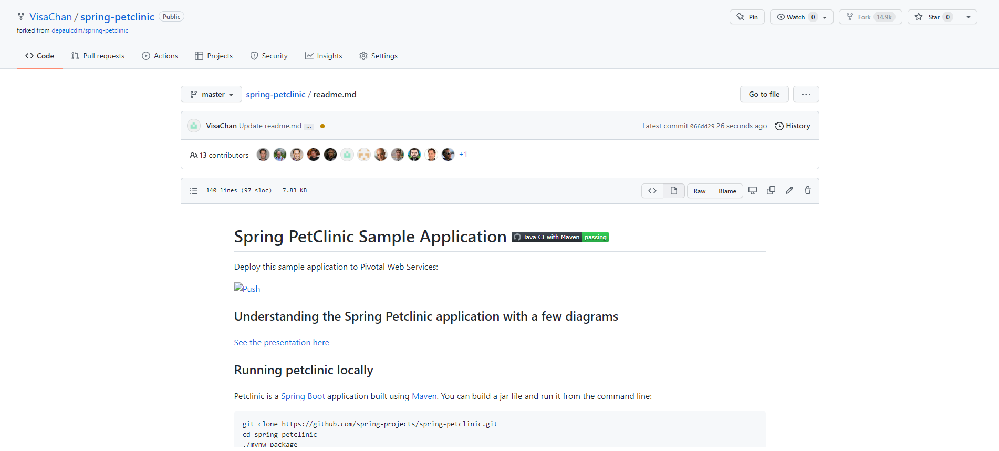  

5 pts The section of the POM file showing the coordinates after you’ve commented them out.  
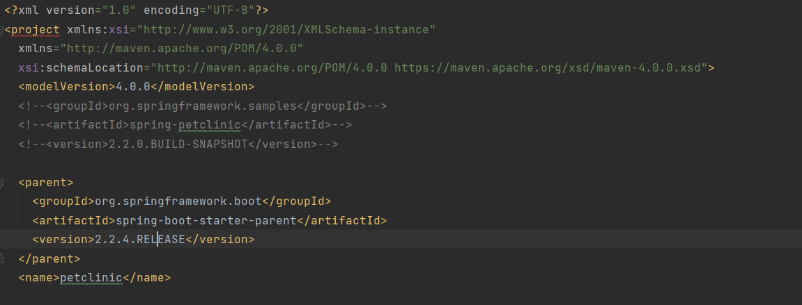  

5 pts Your GitHub Actions dashboard showing the unsuccessful build after the breaking change.  
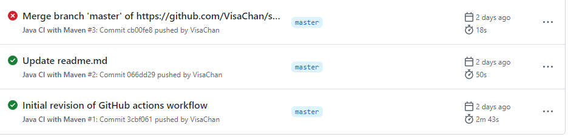  
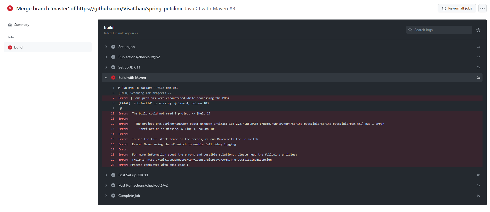  

5 pts Your GitHub repository with the readme.md file selected showing the build failed status after the GitHub workflow fails.  
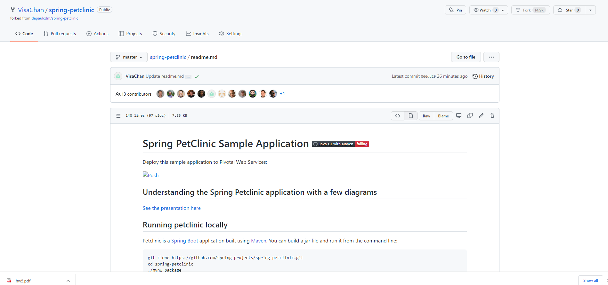  

5 pts The section of the POM file showing the coordinates after you’ve fixed them.  
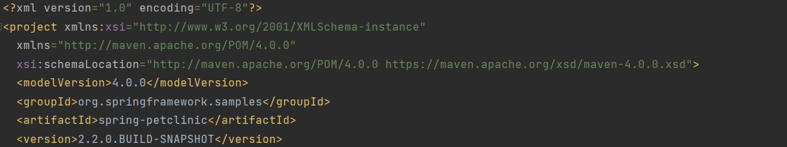  

5 pts Your GitHub Actions dashboard showing the successful build after the breaking change has been fixed.  
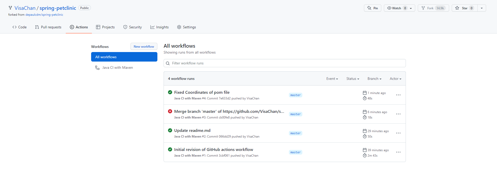  
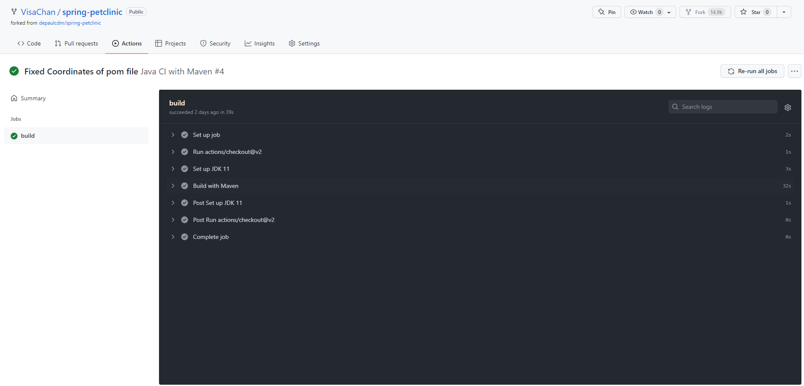  

5 pts Your GitHub repository with the readme.md file selected showing the build success status after the GitHub workflow has recovered.  
  
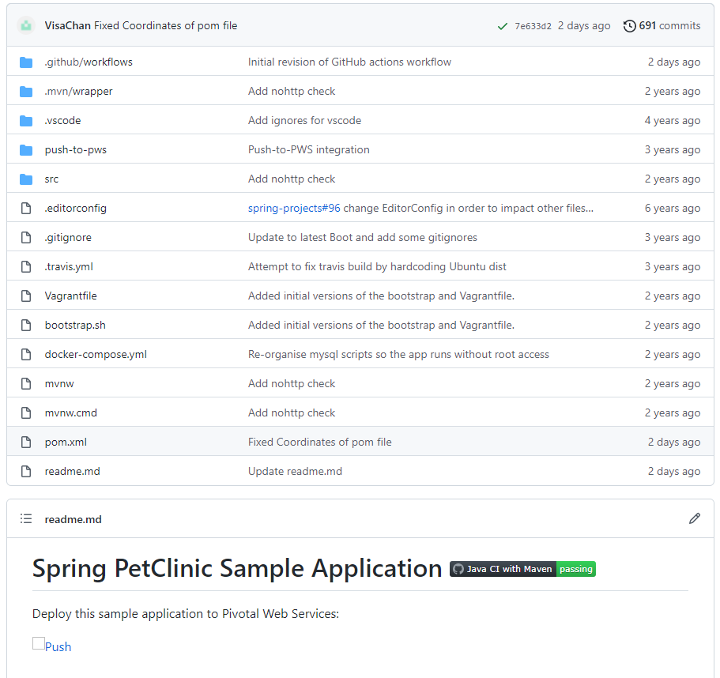  