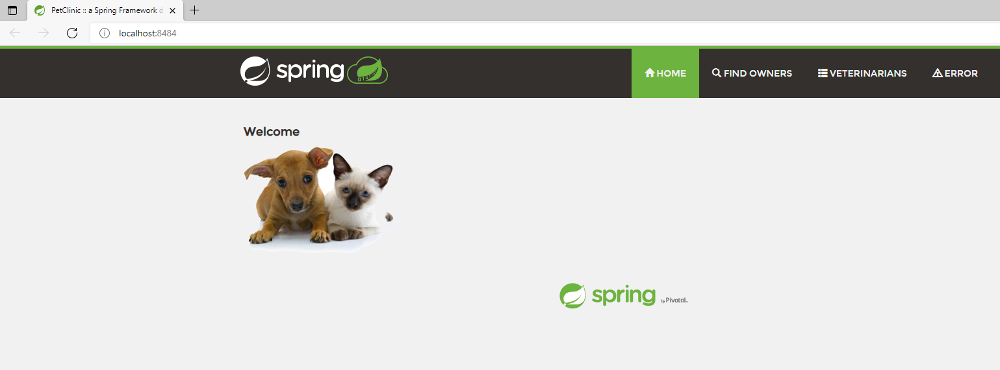
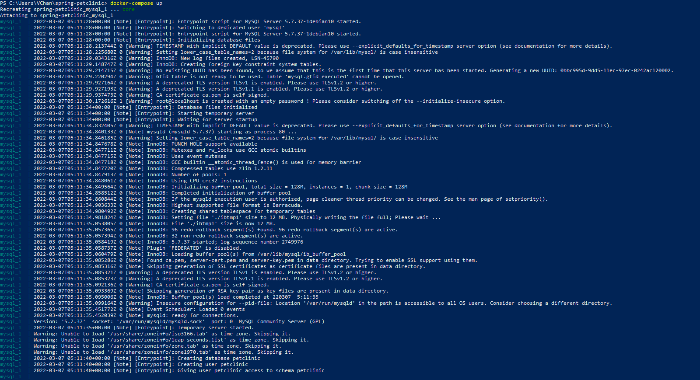
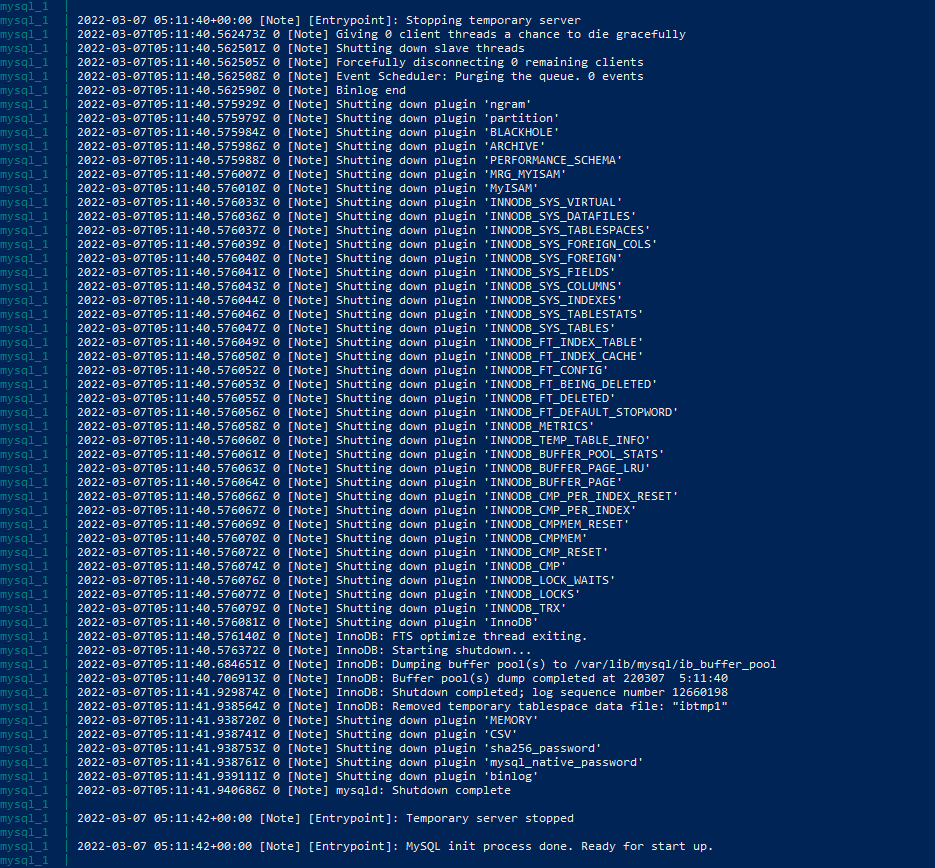
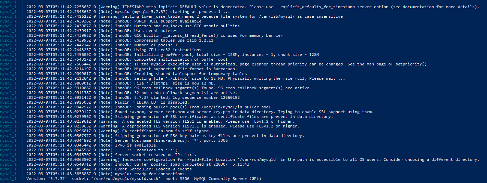
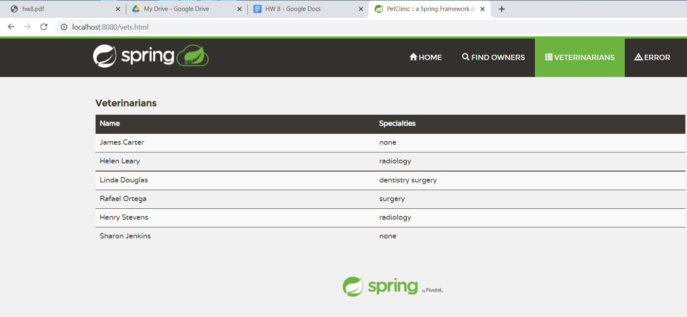
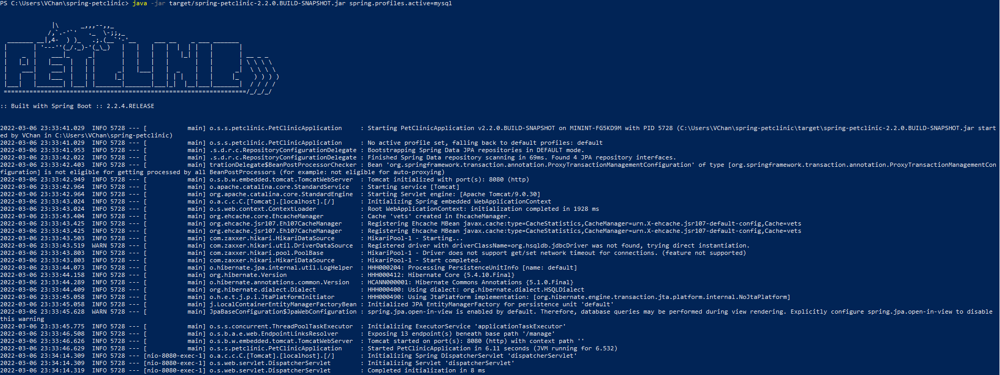
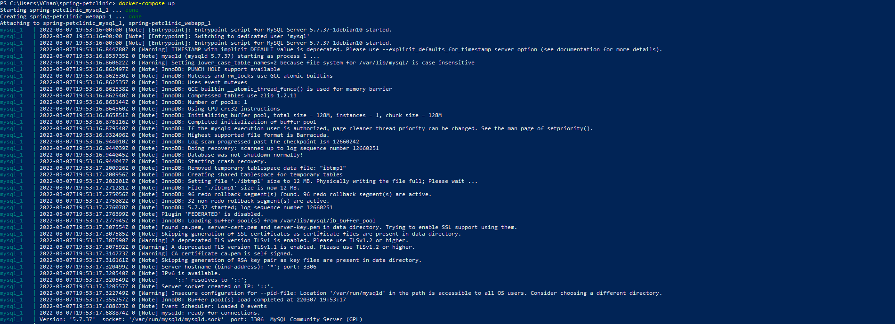
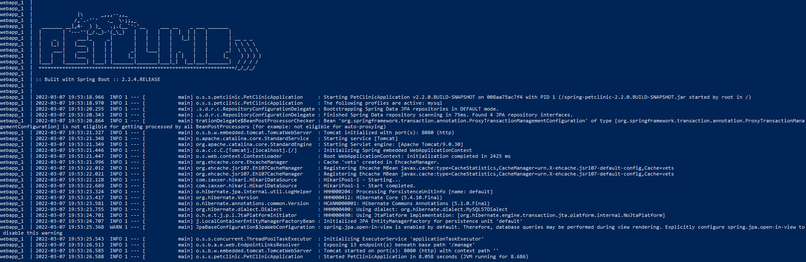
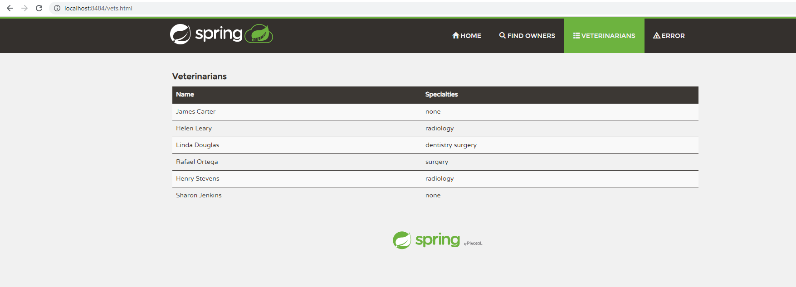

Vincent Chan 1534556

DOCKER  

[5 pts] Your dockerfile. Please provide a link to this file rather than a screen capture.  
dockerfile: https://github.com/VisaChan/spring-petclinic/blob/master/Dockerfile.txt

[5 pts] Your running docker instance as shown by a ps command.  
  

[5 pts] Your browser accessing the main page of the website from your local container.  
  

DOCKER COMPOSE - MYSQL ONLY  

[5 pts] The output from the docker-compose up command.  
  
  
  

[5 pts] Your browser accessing the “Veterinarians” page of the website from your local container when you run the application from the host system.  
  

[5 pts] A section of the stack trace generated when you attempt to run the application container that has been updated to use MySQL.  
  

DOCKER COMPOSE - APP SERVER AND MYSQL  

[5 pts] Your updated docker-compose.yml file containing the application server, built from your local Dockerfile, and the existing MySQL configuration. Please provide a link to this file rather than a screen capture.   
docker-compose file: https://github.com/VisaChan/spring-petclinic/blob/master/docker-compose.yml

[5 pts] Your updated application-mysql.properties file containing the URL change for the database server. Please provide a link to this file rather than a screen capture.  
apllication-mysql.properties file: https://github.com/VisaChan/spring-petclinic/blob/master/src/main/resources/application-mysql.properties

[5 pts] The output from the docker-compose up command.  
  
  

[5 pts] Your browser accessing the “Veterinarians” page of the website from your local container.  
  
